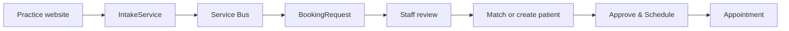

# Cloud Dental Office


**Modern SaaS Practice Management Platform for Dental Providers**

A cloud-native, microservices-based dental practice management system built from the ground up with .NET 8, Blazor Server and deep payer interoperability.

[](https://opensource.org/licenses/Apache-2.0)
[](https://dotnet.microsoft.com)
[](https://dotnet.microsoft.com/apps/aspnet/web-apps/blazor)
[](https://microservices.io)

---

## Architecture

Cloud Dental Office uses a **microservices architecture** with each bounded context deployed as an independent service:

```
┌─────────────────────────────────────────────────────────────┐
│                    Blazor Server Portal                      │
│         (MudBlazor · Dark Theme · Real-time · AI Vision)     │
└──────────────────────────┬──────────────────────────────────┘
                           │
                    ┌──────┴──────┐
                    │ API Gateway │  ← YARP Reverse Proxy
                    │   :5200     │
                    └──────┬──────┘
         ┌─────────┬───────┼───────┬──────────┬──────────┬──────────┐
         │         │       │       │          │          │          │
    ┌────┴───┐ ┌───┴────┐ ┌┴─────┐ ┌┴────────┐ ┌┴──────┐ ┌┴─────┐ ┌┴─────────┐
    │Patient │ │Schedule│ │Claims│ │Eligiblty│ │  ERA  │ │ Auth │ │Rx (EPCS) │
    │Service │ │Service │ │Svc   │ │Service  │ │Service│ │  Svc │ │ :5107    │
    │ :5101  │ │ :5102  │ │:5103 │ │ :5104   │ │ :5105 │ │:5106 │ └─────┬────┘
    └────┬───┘ └───┬────┘ └┬─────┘ └┬────────┘ └┬──────┘ └┬─────┘       │
         │         │       │        │           │         │             │
         │         │       │        │           │     ┌───┴──────┐      │
         │         │       │        │           │     │AI Vision │      │
         │         │       │        │           │     │ Service  │      │
         │         │       │        │           │     │ :5108    │      │
         │         │       │        │           │     └────┬─────┘      │
         │         │       │        │           │          │            │
         └─────────┴───────┴────────┴───────────┴──────────┴────────────┘
                        PostgreSQL (per-service DB)
              ┌──────────────────────┴────────────────────┐
              │  privaseeAI Edge Devices (IP Cameras,     │
              │  Tablets, Raspberry Pi) + Azure AI Vision │
              └───────────────────────────────────────────┘
```

### Services

| Service | Port | Description |
|---------|------|-------------|
| **Portal** | 5000 | Blazor Server UI — dashboard, patient management, claims, scheduling, e-prescribing, AI vision |
| **API Gateway** | 5200 | YARP reverse proxy routing to all backend services |
| **PatientService** | 5101 | Patient demographics, insurance/subscriber info, search |
| **SchedulingService** | 5102 | Appointments, operatory management, provider calendars |
| **ClaimsService** | 5103 | Claim lifecycle (draft → submit → adjudicate), 837D generation |
| **EligibilityService** | 5104 | Real-time 270/271 eligibility verification |
| **EraService** | 5105 | 835 ERA file processing, claim matching, auto-posting |
| **AuthService** | 5106 | JWT authentication, OpenID Connect, multi-tenant identity |
| **PrescriptionService** | 5107 | e-Prescribing with DoseSpot integration, EPCS compliance, Surescripts certified |
| **VisionService** | 5108 | AI vision platform — privaseeAI integration, insurance card OCR (Azure AI Vision), narcotics cabinet monitoring, consent recording, clinical note generation |
| **IntakeService** | 5109 | Isolated public intake. Publishes validated booking requests and stores only minimized, durable integration-inbox records; it has no read access to patient/clinical systems. |

### Shared Libraries

- **CloudDentalOffice.Contracts** — DTOs, integration events, and API contracts shared across services
- **CloudDentalOffice.EdiCommon** — Clean-room X12 EDI parser and generators (837D, 270/271, 835)
- **CloudDentalOffice.Messaging** — Service Bus event-publishing abstraction (`IEventPublisher`)

---

## Public Website Booking Intake

Practice websites (e.g. [3rd Set Smiles](https://github.com/aurelianware/3rdsetsmiles))
submit appointment requests through a **dedicated public service** with no read
access to patient, clinical, or scheduling databases. It accepts only the
minimum information necessary for appointment intake.



`BookingRequest` is the visitor's scheduling intent. `Appointment` is a
practice-confirmed event created only after staff review and approval.

**IntakeService** (the only internet-facing component) exposes:

```
POST /api/public/booking-requests
```

- **Disabled by default** — returns `404` unless `PublicBooking:Enabled` is `true`.
- **Requires an API key** — `Authorization: Bearer <key>` or `X-Api-Key: <key>`,
  compared in constant time. Missing/wrong key → `401`.
- **Rate limited** — fixed window, 5 requests/minute per client IP. Forwarded
  addresses are honored only from explicitly configured `TrustedProxies`.
- **No database access.** It validates the request and publishes a
  `BookingRequestedEvent` to Service Bus, then returns `202 Accepted`
  (`{ status, eventId }`). It cannot read appointments or PHI.

Request body (`PublicBookingRequest`):

```jsonc
{
  "name": "Jane Doe",           // required
  "phone": "480-555-0100",      // required
  "email": "jane@example.com",  // optional
  "patientRelationship": "Existing", // New, Existing, Unknown; missing -> Unknown
  "preferredStart": "2026-08-20T21:00:00Z", // required, UTC ISO-8601 (or offset), must be future
  "durationMinutes": 60,        // optional preference
  "reason": "New patient exam", // optional
  "message": "Second choice: Friday" // optional
}
```

`preferredStart` must carry a timezone (UTC `Z` or an explicit offset); a value
with no timezone is rejected.

**SchedulingService** runs a `BookingRequestConsumer` (a `BackgroundService`) that
subscribes to the topic and creates a durable `BookingRequest`:

- No placeholder patient or provider is required.
- `(TenantId, EventId)` uniqueness prevents duplicates during Service Bus redelivery.
- Malformed events are dead-lettered and processing failures remain eligible for retry.
- Staff use **Appointment Requests** to match/create the patient, review the
  provider and actual slot, approve and schedule, reject, or request follow-up.

### Failure behavior (the website keeps working)

The topic decouples the website from the scheduler:

- **SchedulingService down / deploying:** IntakeService still returns `202` and
  the event waits durably in the `scheduling` subscription until the consumer
  comes back and processes it. **No booking is lost and the website is
  unaffected.**
- **Service Bus unreachable, or not configured:** IntakeService returns `503`
  (rather than a false `202`), so the calling website falls back to its own
  delivery path (e.g. email).
- IntakeService has an isolated inbox database and no access to the scheduling
  database, so a scheduling-database outage does not affect durable webhook intake.

### Configuration

**IntakeService** (`PublicBooking` + `ServiceBus` sections):

| Key | Purpose |
|-----|---------|
| `PublicBooking:Enabled` | Master switch (default `false`). |
| `PublicBooking:ApiKey` / `PublicBooking:TenantId` | Backwards-compatible single-practice credential mapping. |
| `PublicBooking:Clients:{index}:ApiKey` / `TenantId` | Credential-to-tenant mappings for multiple practices. Store these in a secret provider. |
| `TrustedProxies` | Proxy IPs allowed to supply forwarded client headers. |
| `ConnectionStrings:IntakeDb` | Isolated durable inbox database (PostgreSQL in production). |
| `IntegrationInbox:*` | Dispatcher batch, lease, bounded retry, and tenant admin-client settings. |
| `ServiceBus:ConnectionString` | Service Bus namespace connection string. Empty → events are logged and dropped. |
| `ServiceBus:BookingTopic` | Topic to publish to (default `booking-requests`). |

**SchedulingService** (`PublicBooking` + `ServiceBus` sections):

| Key | Purpose |
|-----|---------|
| `PublicBooking:RequireApiKeyForReads` | When `true`, `GET /api/appointments*` also require the API key (default `false`). |
| `ServiceBus:ConnectionString` | Same namespace as IntakeService. Empty → the consumer stays idle. |
| `ServiceBus:BookingTopic` / `ServiceBus:BookingSubscription` | Defaults `booking-requests` / `scheduling`. |

Environment-variable form uses double underscores, e.g. `PublicBooking__ApiKey`,
`ServiceBus__ConnectionString`. You must create the topic and the `scheduling`
subscription in your Service Bus namespace.

### Upgrade note

The service creates the new `BookingRequests` table and indexes on startup for
SQLite, PostgreSQL, and SQL Server. The earlier prototype stored scheduling
patient/provider identifiers as GUID placeholders; this workflow aligns them
with the integer identifiers exposed by the current PatientService/Portal.
Before upgrading a non-empty scheduling database created by the earlier public
booking prototype, archive any `Requested` placeholder appointments and rebuild
or explicitly migrate the `Appointments.PatientId` and `ProviderId` columns.
Fresh local/Kubernetes databases require no manual step.

### Deployment boundary (important)

Expose **only IntakeService** to the internet (TLS + the API key at the edge).
Keep `api-gateway` and every PHI-bearing service — including `SchedulingService`
and its anonymous `GET /api/appointments*` reads — on the **private** network.
IntakeService has no database and cannot read clinical or patient records.
Visitor-submitted contact and visit information must nevertheless be handled as
sensitive healthcare information.

3rd Set Smiles is the first reference integration, but no practice name or
internal patient/provider/location identifier is coupled to this workflow.

If (against this guidance) `SchedulingService` is ever reachable from the
internet, set `PublicBooking:RequireApiKeyForReads=true` as defense-in-depth so
its reads require the API key (the Portal must then present the key on its
scheduling calls). CORS is **not** required — the website calls IntakeService
server-to-server.

---

## Quick Start

### Docker Compose (recommended)

```bash
git clone https://github.com/aurelianware/clouddentaloffice.git
cd clouddentaloffice
docker-compose up -d
```

Portal: http://localhost:5000
API Gateway: http://localhost:5200
Swagger (per service): http://localhost:510x/swagger

### Local Development

```bash
# Prerequisites: .NET 8 SDK, PostgreSQL (or use SQLite default)

git clone https://github.com/aurelianware/clouddentaloffice.git
cd clouddentaloffice

# Restore, build, and run all deterministic tests
dotnet restore CloudDentalOffice.sln
dotnet build CloudDentalOffice.sln --no-restore
dotnet test CloudDentalOffice.sln --no-restore --no-build

# Run individual services
dotnet run --project src/Services/PatientService
dotnet run --project src/Services/ClaimsService
dotnet run --project src/Services/ApiGateway
dotnet run --project src/CloudDentalOffice.Portal
```

Each service defaults to SQLite for local dev — no database setup required.

### Continuous integration

`.github/workflows/ci.yml` runs for pull requests and pushes to `main` using the
.NET 8 SDK selected by `Directory.Build.props` and the .NET 8 deployment
Dockerfiles. It restores and builds the complete solution, then runs every test
project included in `CloudDentalOffice.sln`:

- `CloudDentalOffice.Portal.Tests`
- `SchedulingService.Tests`
- `IntakeService.Tests`

Test output is written as TRX and uploaded for 14 days, including on failure.
Configure the following checks as required status checks for `main` branch
protection:

```text
CI / Build
CI / Tests
```

Azure deployment runs only after the `CI` workflow succeeds for the exact
`main` commit. Manually dispatched Azure and DOKS deployments invoke the same
reusable validation workflow before any registry login, image build, push, or
deployment step.

The `Zocdoc.IntegrationTests` project is deliberately not in the normal solution.
It contacts Zocdoc's external sandbox and requires partner-issued credentials.
Run it locally as documented in
[`src/Services/Zocdoc.IntegrationTests/README.md`](src/Services/Zocdoc.IntegrationTests/README.md),
or manually dispatch **Zocdoc Sandbox Certification**. Store
`ZOCDOC_SANDBOX_CLIENT_ID` and `ZOCDOC_SANDBOX_CLIENT_SECRET` in the protected
`zocdoc-sandbox` GitHub environment. The workflow fails with a configuration
message when either secret is absent and never runs for pull requests.

### Local Kubernetes

CloudDentalOffice runs in its own `clouddental` namespace. The local overlay uses
portable Kubernetes resources, an in-cluster PostgreSQL instance, and local images;
it does not depend on Azure or DigitalOcean services.

Prerequisites: Docker, `kubectl`, and a running local cluster. The helper recognizes
a kind cluster named `docker-desktop` by default and loads images into it. The helper
generates the local database password and JWT signing key directly in the cluster;
these credentials are not stored in the repository.

```bash
./scripts/deploy-local-k8s.sh
kubectl port-forward -n clouddental service/portal 5000:5000
```

Then open http://localhost:5000 and sign in with
`demo@clouddentaloffice.com` / `Password123!`.

Useful overrides:

```bash
# Re-apply manifests without rebuilding images
SKIP_BUILD=true ./scripts/deploy-local-k8s.sh

# Use another kind cluster name
KIND_CLUSTER_NAME=my-cluster ./scripts/deploy-local-k8s.sh
```

The manifests are under `infrastructure/k8s/local`. The reusable application
manifests remain under `infrastructure/k8s/clouddental` for cloud deployments.

#### CloudHealthOffice claim flow

The local portal configures the demo payer to submit to the CloudHealthOffice
claims service in the separate `cloudhealthoffice` namespace:

```text
CloudDentalOffice (clouddental)
  -> generate ASC X12 005010X224A2 837D
  -> POST multipart file to claims-service.cloudhealthoffice.svc.cluster.local
  -> /api/v1/claims/import/raw837
  -> CloudHealthOffice validation and adjudication pipeline
```

Override `CloudHealthOffice__BaseUrl` in the portal deployment when the payer
platform uses a different namespace or an external URL. CloudHealthOffice must
contain matching member, provider, and benefit configuration for the submitted
claim to adjudicate successfully; otherwise its raw-837 response is shown as a
claim-submission rejection in CloudDentalOffice.

---

## EDI / Payer Interoperability

Cloud Dental Office provides native support for dental EDI transactions:

| Transaction | Standard | Status |
|-------------|----------|--------|
| 837D Claims | ASC X12 005010X224A2 | ✅ Generator implemented |
| 270/271 Eligibility | ASC X12 005010X279A1 | 🔧 In progress |
| 835 ERA | ASC X12 005010X221A1 | 🔧 In progress |
| 276/277 Claim Status | ASC X12 005010X212 | 📋 Planned |
| 278 Prior Auth | ASC X12 005010X217 | 📋 Planned |

Designed to pair with **[Cloud Health Office](https://github.com/aurelianware/cloudhealthoffice)** for end-to-end provider ↔ payer automation.

---

## AI Vision Platform

Cloud Dental Office integrates with **privaseeAI** edge devices to provide intelligent vision capabilities for dental practices:

### Features

| Feature | Description | Status |
|---------|-------------|--------|
| **Insurance Card OCR** | Automatic extraction of member ID, payer info, group numbers from insurance cards using Azure AI Vision | ✅ Implemented |
| **Narcotics Cabinet Monitoring** | Real-time detection and compliance tracking for controlled substance access with badge verification | ✅ Implemented |
| **Patient Consent Recording** | Video-verified consent capture with detection of patient, provider, and consent forms | ✅ Implemented |
| **Clinical Note Generation** | AI-assisted procedure documentation from instrument detection and procedure observations | ✅ Implemented |
| **Real-time Detection** | SignalR hub for live camera feeds and event streaming | ✅ Implemented |
| **Device Management** | Multi-device registration and monitoring (IP cameras, tablets, Raspberry Pi, mobile devices) | ✅ Implemented |

### Detection Classes

The VisionService supports detection of:
- **Generic objects**: Person, Document, Cell Phone, Backpack, Handbag (COCO-SSD)
- **Dental instruments**: Handpiece, Mirror, Explorer, Forceps, Elevator, Scaler/Curette, Syringes, Suture Kit, Cotton Roll, Gauze, Impression Tray, Crown/Bridge, Dental Dam
- **Documents**: Insurance cards, consent forms, ID documents, prescription pads
- **Security**: Cabinet door status, badge scanning, medication vials, narcotics safe monitoring

### Architecture

```
┌───────────────────────────────────────────────────────────────┐
│                     privaseeAI Edge Devices                    │
│  (IP Cameras, Tablets, Raspberry Pi, Mobile Devices)          │
│                  ↓ Detection Events (HTTPS)                   │
└───────────────────────────────────────────────────────────────┘
                              ↓
┌───────────────────────────────────────────────────────────────┐
│                      VisionService (:5108)                     │
│  ┌─────────────────┐  ┌────────────────┐  ┌────────────────┐ │
│  │ Ingest Detections│→│Context Correlate│→│ Event Storage │ │
│  │  (REST API)      │  │   (Appt/Pt)     │  │  (PostgreSQL) │ │
│  └─────────────────┘  └────────────────┘  └────────────────┘ │
│                              ↓                                 │
│  ┌─────────────────┐  ┌────────────────┐  ┌────────────────┐ │
│  │ SignalR Hub      │  │  Azure AI      │  │ Alert Engine  │ │
│  │ (Real-time)      │  │  Vision OCR    │  │ (Compliance)  │ │
│  └─────────────────┘  └────────────────┘  └────────────────┘ │
└───────────────────────────────────────────────────────────────┘
                              ↓
┌───────────────────────────────────────────────────────────────┐
│                   Portal UI — AI Vision Pages                  │
│  • Vision Dashboard  • Device Management  • Events & Alerts    │
│  • Insurance Scans   • Consent Recording  • Cabinet Access     │
│  • Clinical Notes                                              │
└───────────────────────────────────────────────────────────────┘
```

### Configuration

The VisionService supports two modes:
- **Development/Mock**: Uses mock OCR and correlation providers for testing without external dependencies
- **Production**: Integrates with Azure AI Vision API and live correlation engine

Configure via `appsettings.json`:
```json
{
  "OcrProvider": "AzureAiVision",  // or "Mock"
  "CorrelationProvider": "Live",    // or "Mock"
  "AzureAiVision": {
    "Endpoint": "https://yourresource.cognitiveservices.azure.com/",
    "ApiKey": "your-api-key"
  }
}
```

---

## Project Structure

```
clouddentaloffice/
├── CloudDentalOffice.sln          # Solution file
├── Directory.Build.props          # Shared build settings
├── docker-compose.yml             # Full stack orchestration
├── src/
│   ├── CloudDentalOffice.Portal/  # Blazor Server UI (your existing Portal)
│   ├── CloudDentalOffice.Portal.Tests/
│   ├── Services/
│   │   ├── ApiGateway/            # YARP reverse proxy
│   │   ├── PatientService/        # Patient bounded context
│   │   ├── SchedulingService/     # Scheduling bounded context
│   │   ├── ClaimsService/         # Claims bounded context
│   │   ├── EligibilityService/    # 270/271 bounded context
│   │   ├── EraService/            # 835 bounded context
│   │   ├── AuthService/           # Identity bounded context
│   │   ├── PrescriptionService/   # e-Prescribing (DoseSpot, EPCS)
│   │   └── VisionService/         # AI Vision (privaseeAI, Azure AI)
│   └── Shared/
│       ├── CloudDentalOffice.Contracts/   # Shared DTOs & events
│       └── CloudDentalOffice.EdiCommon/   # X12 parser & generators
├── infrastructure/
│   ├── docker/                    # Per-service Dockerfiles
│   ├── k8s/                       # Kubernetes manifests
│   └── azure/                     # Azure Bicep/ARM templates
├── scripts/
│   └── seeds/                     # Database init & seed data
└── docs/                          # Architecture & API documentation
```

---

## Technology Stack

- **.NET 8** — All services and portal
- **Blazor Server** with **MudBlazor** — Responsive UI with dark theme
- **Entity Framework Core** — Multi-provider (PostgreSQL, SQL Server, SQLite)
- **YARP** — API Gateway / reverse proxy
- **Docker** + **Kubernetes** — Container orchestration
- **Azure** — Cloud deployment (Bicep IaC templates)
- **JWT / OpenID Connect** — Authentication and multi-tenant identity
- **SSH.NET** — SFTP for clearinghouse file exchange
- **DoseSpot** — Electronic prescription (eRx) and EPCS integration

---

## Roadmap

- [x] Microservices architecture with per-service databases
- [x] API Gateway with YARP
- [x] Patient, Scheduling, Claims, Eligibility, ERA, Auth services
- [x] e-Prescribing service with DoseSpot integration (EPCS, Surescripts)
- [x] AI Vision service — privaseeAI integration for dental practice automation
- [x] Insurance card OCR with Azure AI Vision
- [x] Narcotics cabinet monitoring and compliance tracking
- [x] Video consent recording and verification
- [x] Clinical note generation from procedure observations
- [x] Clean-room X12 837D claim generator
- [x] Docker Compose full-stack deployment
- [x] Blazor Portal integration with microservices via API Gateway
- [x] Kubernetes deployment manifests (DOKS)
- [x] CI/CD with GitHub Actions
- [x] Send 837D Claim transactions to payer SFTP
- [ ] Full 270/271 real-time eligibility checks
- [ ] 835 ERA auto-posting & reconciliation
- [ ] 276/277 claim status polling
- [ ] 278 prior authorization
- [ ] Multi-location / DSO support
- [ ] Azure AD B2C / OpenID Connect auth
- [ ] Kubernetes Helm charts
- [ ] Availity Integration
- [ ] Change Healthcare Integration

---

## Related Projects

- **[Cloud Health Office](https://github.com/aurelianware/cloudhealthoffice)** — Payer-side EDI platform (X12, FHIR R4, CMS-0057-F compliance)
- Together, Cloud Dental Office + Cloud Health Office provide complete provider ↔ payer interoperability

---

## License

[Apache License 2.0](LICENSE) — Copyright 2025 Aurelianware, Inc.
