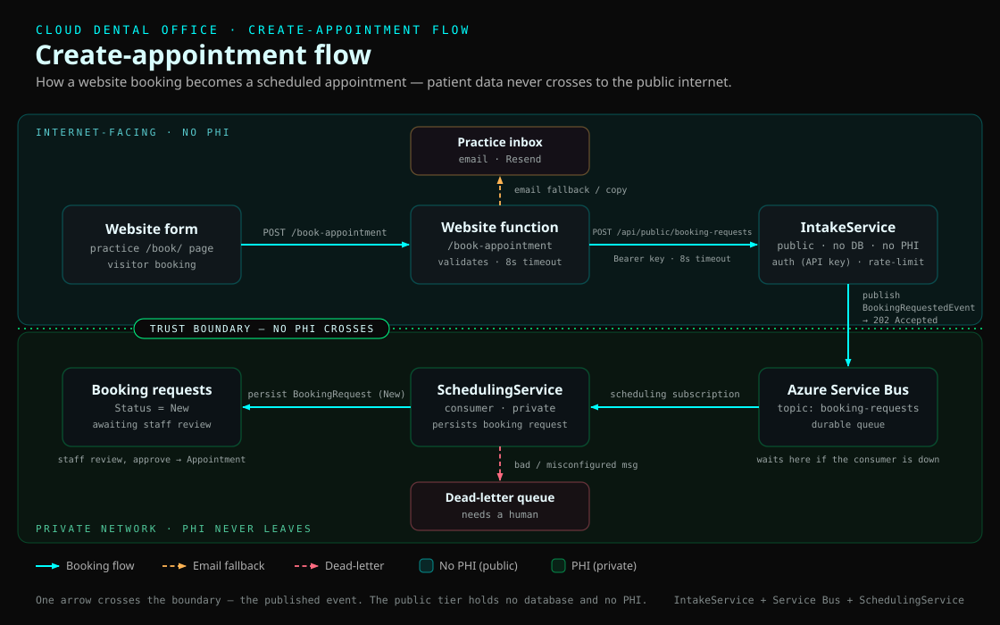

# Architecture

## Create-appointment flow

A booking submitted on a practice website (e.g. [3rd Set Smiles](https://github.com/aurelianware/3rdsetsmiles))
becomes an unconfirmed appointment **without patient data ever crossing to the public internet**:

1. The website posts to the public **IntakeService**, which authenticates
   (constant-time API key), validates, rate-limits, and **publishes a
   `BookingRequestedEvent`** to the `booking-requests` Service Bus topic — then
   returns `202 Accepted`. It has **no database and no PHI**.
2. On the private network, the **SchedulingService** `BookingRequestConsumer`
   reads the `scheduling` subscription, resolves provider/location/patient from
   configuration, and writes the appointment with `Status = Requested`
   (unconfirmed). Unprocessable messages are dead-lettered.
3. Staff confirm the request in the Portal, moving it to `Scheduled`.

Only one arrow crosses the trust boundary — the published event — and nothing
flows back up, so the internet-facing tier carries no PHI.

**Resilience.** If the SchedulingService is down, the event waits durably in the
subscription (nothing is lost). If the broker is unreachable or unconfigured,
IntakeService returns `503` and the website falls back to emailing the practice.

### Source

- `src/Services/IntakeService` — the public endpoint
- `src/Services/SchedulingService/BookingRequestConsumer.cs` — the private consumer
- `src/Shared/CloudDentalOffice.Messaging` — the Service Bus publisher abstraction
- `src/Shared/CloudDentalOffice.Contracts/Events/IntegrationEvents.cs` — `BookingRequestedEvent`

> The diagram is a hand-authored SVG (`create-appointment-flow.svg`) themed to
> match the Sentinel Portal. Edit the SVG directly to update it.
