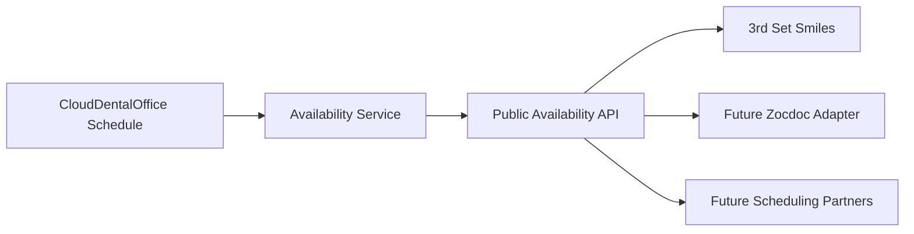

# Public availability API

CloudDentalOffice (CDO) publishes **bookable appointment availability** to
external scheduling partners — the practice website today, and future
marketplaces such as Zocdoc or Google — through a single, versioned,
vendor-neutral contract. CDO remains the **system of record** for scheduling;
partners read availability, they do not own it.



## Calculation path (one authoritative engine)

There is exactly one availability calculation in the platform. Every channel —
the website, the Zocdoc availability synchronizer, the ICS feed — flows through
it.

```text
SchedulingService schedule, rules, mappings, blocks, appointments
        ↓
ISchedulingAvailabilityService (SchedulingAvailabilityService)   ← canonical, vendor-neutral
        ↓
IPublicWebsiteSchedulingService.GetPublishedAsync                ← data-minimized projection + time zone
        ↓  (private, X-CDO-Service-Key, tenant-bound)
IntakeService  GET /api/public/v1/availability[.ics]             ← internet edge (auth, rate limit)
        ↓
Partner (website / Zocdoc adapter / marketplace)
```

`SchedulingAvailabilityService` respects provider working hours, existing
appointments, blocked periods, per–appointment-type duration, the booking lead
time and horizon, provider/location filters, and the practice time zone. Slots
are generated on the configured increment and never include a start time that
cannot fit the whole appointment duration.

## Contract

`IntakeService` is the only internet-facing component. The versioned endpoints
are **disabled by default** (return `404` unless `PublicBooking:Enabled` is
`true`), require an API key (`Authorization: Bearer <key>` or `X-Api-Key`,
constant-time compared), and are rate limited per client IP.

```
GET /api/public/v1/availability
    ?providerId=dr-phillips
    &locationId=heber
    &appointmentTypeId=new-patient-exam
    &patientRelationship=New        # optional; defaults to New
    &from=2026-08-20T00:00:00Z
    &to=2026-08-27T00:00:00Z
```

- `providerId`, `locationId`, `appointmentTypeId` are **public channel codes**
  (slugs), never CDO database identifiers. They are optional filters.
- `from`/`to` are timezone-aware timestamps. The range is capped (31 days at the
  edge; the practice's `MaximumBookingHorizonDays`, 30–90, clamps it further).

Response:

```jsonc
{
  "providerCode": "dr-phillips",
  "locationCode": "heber",
  "appointmentTypeCode": "new-patient-exam",
  "timeZone": "America/Phoenix",
  "from": "2026-08-20T00:00:00+00:00",
  "to": "2026-08-27T00:00:00+00:00",
  "slots": [
    {
      "availabilityToken": "…",          // opaque, encrypted, short-lived selection
      "appointmentTypeCode": "new-patient-exam",
      "appointmentTypeName": "New patient exam",
      "providerCode": "dr-phillips",
      "providerName": "Dr. Phillips",
      "locationCode": "heber",
      "locationName": "Heber office",
      "start": "2026-08-20T09:00:00-07:00",
      "end": "2026-08-20T10:00:00-07:00",
      "durationMinutes": 60
    }
  ]
}
```

Timestamps are returned in the practice's local offset; `timeZone` names the
zone explicitly. The `availabilityToken` encodes the canonical **UTC** instant,
so the display offset never affects booking revalidation.

### ICS feed

```
GET /api/public/v1/availability.ics?from=…&to=…[&providerId=…&locationId=…&appointmentTypeId=…]
```

Returns `text/calendar; charset=utf-8`. Each bookable slot becomes one `VEVENT`
(`TRANSP:TRANSPARENT`, summary `Available — <type>`). A busy period simply has
no event, because the slot was excluded upstream. The feed contains no patient
data, no appointment details, and no internal calendar events — only free time.

## Privacy / HIPAA boundary

The public availability surface represents **free/bookable time, not the
calendar**. A booked or blocked period only causes a slot to be *absent*. The
response never contains patient names or IDs, existing-appointment details,
phone/email, insurance, clinical history, notes, or the tenant identifier. The
opaque booking token is encrypted (AES-GCM) and carries no readable identifiers.

## Booking revalidation (race conditions)

An availability lookup is not a hold. When a booking is submitted
(`POST /api/public/booking-requests` with the slot's `availabilityToken`),
IntakeService calls `IPublicWebsiteSchedulingService.ValidateAsync`, which
**re-runs the canonical engine**. If the slot has since been consumed, the API
returns `409 Conflict`:

```json
{ "message": "That appointment time is no longer available. Please choose another time." }
```

Partners must treat previously loaded availability as advisory and reload on
conflict; the browser's cached availability is never authoritative.

## Adding a scheduling partner (e.g. Zocdoc)

The availability calculation is already vendor-neutral, so a new partner is an
**adapter**, not a new engine:

1. Register an `ISchedulingChannelAdapter` for the channel (see
   [Scheduling integrations](scheduling-integrations.md)); availability comes
   from the same `ISchedulingAvailabilityService`.
2. Map the partner's provider/location/visit-reason IDs to CDO codes via
   `ExternalSchedulingResourceMapping` for that channel.
3. Publish/booking flow reuses `SchedulingBookingCommand` and the same
   revalidation guard.

No Zocdoc-specific payloads are implemented until Zocdoc's integration
specification is provided and validated — this contract does not claim Zocdoc
compatibility.
